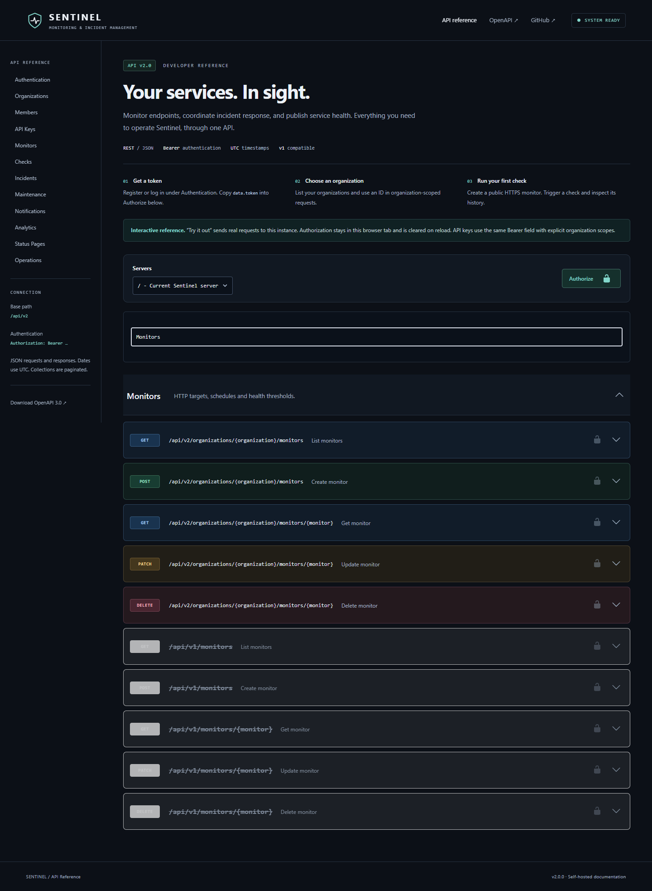

<h1 align="center">Sentinel</h1>

HTTP monitoring and incident management for teams.

Sentinel checks public HTTP endpoints, opens incidents after consecutive failures, and resolves them after sustained recovery. V2 adds organization boundaries, team roles, automation credentials, asynchronous notifications, maintenance windows, availability metrics, and public status pages.

The API is the product interface. The self-hosted Swagger UI supports the complete workflow; there is no SPA or frontend build to run.

## Quick start

Requires Docker Engine with the Compose plugin (Docker Desktop on Windows/macOS). No PHP, Composer, Node, or Make installation is needed on the host.

~~~sh
git clone https://github.com/EduardoCaversan/sentinel.git
cd sentinel
cp .env.example .env
docker compose up --build -d --wait
~~~

PowerShell: `Copy-Item .env.example .env` is equivalent to the copy command.

| Address | Purpose |
| --- | --- |
| http://localhost:8080 | Technical landing |
| http://localhost:8080/docs | Interactive Swagger UI |
| http://localhost:8080/openapi.json | OpenAPI contract |
| http://localhost:8080/health | Process liveness |
| http://localhost:8080/health/ready | MariaDB and Redis readiness |

Initialization generates a local encryption key in the shared storage volume and applies migrations. MariaDB, Redis, Apache/PHP, Horizon, and scheduler start together. Port 8080 binds to loopback; change `APP_PORT` and `APP_URL` if needed.

`make setup`, `make up`, `make down`, `make test`, `make lint`, `make analyse`, `make operations`, `make logs`, and `make shell` are optional conveniences.

## Demonstrate it through Swagger

1. Open `/docs`. Under **Authentication**, use **POST /api/v2/auth/register**. Choose an email and password (12–72 characters, a letter and a number, matching confirmation).
2. Copy `data.token`. Click **Authorize**, paste the token without the `Bearer` prefix, apply credentials, and close the dialog. Authorization clears on reload.
3. Under **Organizations**, list your organizations. Registration creates a personal organization for compatibility. Optionally create a shared organization and copy its ID.
4. Under **Monitors**, create a monitor in that organization:

   ~~~json
   {
     "name": "Payment API",
     "url": "https://example.com",
     "expected_status_code": 503,
     "interval_seconds": 300,
     "failure_threshold": 2,
     "recovery_threshold": 2,
     "slo_target": 99.9
   }
   ~~~

   The deliberately different expected status makes example.com's normal HTTP 200 count as a failure.
5. Under **Checks**, request a manual check, wait for its history entry, and repeat. After two failures, inspect **Incidents**, acknowledge the incident, add a note, and read its timeline.
6. Patch `expected_status_code` to `200`; run two more checks. The incident resolves automatically. Manual requests return `202` and are deduplicated while queued/running.
7. Under **Analytics**, inspect the monitor's `24h` metrics and SLO. Timestamps have second precision; a check in the current second may appear on the next refresh.
8. Under **Maintenance**, create a future window using UTC dates within the next 90 days.
9. Under **Status Pages**, create a page with explicit component aliases and `is_published: true`. Visit `/status/{slug}` or the unauthenticated `/api/v2/status/{slug}`.
10. Under **API Keys**, create an organization key with selected scopes. Replace the personal token in **Authorize** to test automation access. Account/member/key administration requires a personal token.
11. Under **Notifications**, configure your own public HTTPS receiver or Slack/Discord webhook. URLs and signing secrets are write-only. Inspect delivery attempts after the next subscribed transition.

No fixed credentials are shipped. To seed an example account, three monitors, 16 historical checks, a resolved incident, and a public demo status page, set `DEMO_SEED=true`, `DEMO_EMAIL`, and a strong `DEMO_PASSWORD` in `.env`, then rerun Compose. The seeder is idempotent and publishes only the selected demo components. All demo monitors target `example.com`; their histories are synthetic.

## V2 capabilities

- Organizations: owner/admin/member/viewer roles, single-use invitations, member removal, leaving, and ownership transfer.
- Organization API keys: random secrets shown once, SHA-256 hashes, explicit scopes, expiry, revocation, and last-use tracking.
- GET monitors, paginated checks/incidents, manual checks, and V1 compatibility.
- Incident acknowledgement by user or key, notes, duration, and a timeline combining retained checks with human/state events.
- Generic HTTPS webhooks, Slack and Discord; encrypted secrets, durable outbox, retries, and delivery audit.
- One-time maintenance windows covering selected monitors.
- Sample uptime, latency average/p50/p95/p99, incident count, clipped downtime, MTTR, and SLO budgets.
- Public status JSON and escaped server-rendered HTML exposing explicit aliases.
- Quotas, batched retention, structured logs, private CLI metrics, and liveness/readiness.

**Stack:** PHP 8.4, Laravel 12, MariaDB 11.4, Redis 7.4, Sanctum, Horizon, PHPUnit, Pint, Larastan level 5, OpenAPI 3.0, Swagger UI, Docker Compose, GitHub Actions. PHP dependencies are locked.

## Architecture

~~~mermaid
flowchart TD
    Client[Swagger / API client] --> Auth[Sanctum or scoped organization key]
    Auth --> Boundary[Organization access and scoped bindings]
    Boundary --> API[Requests / controllers / resources]
    API --> DB[(MariaDB)]
    API --> Queue[(Redis queues and locks)]
    Scheduler[Laravel Scheduler] --> Dispatch[Dispatch due monitors]
    Dispatch --> Queue
    Queue --> Worker[Horizon: checks]
    Worker --> Probe[Public DNS validation + pinned HTTP probe]
    Probe --> Record[RecordCheck transaction]
    Record --> DB
    Record --> Outbox[Durable notification deliveries]
    Outbox --> NotificationDispatcher[Minute dispatcher]
    NotificationDispatcher --> Queue
    Queue --> Delivery[Horizon: notifications]
    Delivery --> Receiver[Validated HTTPS receiver]
    Delivery --> DB
    Public[Public status API / Blade page] --> Published[Explicit publication projection]
    Published --> DB
~~~

Small concrete services hold business logic: `RecordCheck` centralizes transitions, `PublicTarget` enforces target policy, `WebhookSender` handles provider payloads/transport, and `MonitorAnalytics` performs SQL calculations. No repositories or internal event bus. Persisted outbox events decouple delivery without external work in a monitoring transaction.

### Monitoring lifecycle

Every minute, the scheduler dispatches unique jobs for active, due monitors. A worker takes a Redis lock, revalidates DNS, pins the public address, and probes with bounded timeout/body size. A database transaction locks the monitor and rejects stale configuration or duplicate execution UUIDs. Check, streaks, incident, timeline transition and outbox rows commit together.

~~~mermaid
stateDiagram-v2
    [*] --> Unknown
    Unknown --> Healthy: success
    Unknown --> Degraded: failure below threshold
    Healthy --> Degraded: failure below threshold
    Degraded --> Healthy: success resets failures
    Degraded --> Down: failure threshold
    Down --> Down: failures or incomplete recovery
    Down --> Healthy: recovery threshold
~~~

A threshold of one can transition directly to down. Acknowledgement leaves automatic recovery enabled. Configuration edits reset streaks; existing incidents stay open until recovery. Deleting a monitor explicitly deletes its history.

### Maintenance

Windows are half-open UTC intervals: `[start_at, end_at)`. Checks continue with `in_maintenance=true` and do not affect uptime/SLO or successful-check latency statistics. No incident or notification transition occurs during maintenance. Existing incidents stay open.

Streaks reset across a window, including when no check occurred inside it. Fresh evidence is required afterward. Started windows are immutable through the API; future windows can be cancelled. Recurrence is deferred.

### Organizations and roles

| Permission | Owner | Admin | Member | Viewer |
| --- | :---: | :---: | :---: | :---: |
| Read monitors, incidents, analytics, maintenance, status configuration | ✓ | ✓ | ✓ | ✓ |
| Operate monitors, acknowledge/note incidents, schedule maintenance | ✓ | ✓ | ✓ | |
| Update organization, manage non-admin members | ✓ | ✓ | | |
| Manage keys, notification channels, status pages | ✓ | ✓ | | |
| Manage administrators / transfer ownership | ✓ | | | |

Member/email listings are owner/admin only. Owners transfer before leaving; personal organizations cannot transfer. Removing a member preserves organization data. Monitor `user_id` is an optional creator; `organization_id` determines access.

Invitations reserve member quota, expire in seven days, are hashed in storage, and are accepted once by an account with the invited email. The inviter distributes the one-time token securely; automatic invitation email and email verification are not implemented.

API key scopes are independent: write does not imply read.

~~~text
monitors:read          monitors:write
incidents:read         incidents:write
maintenance:read       maintenance:write
analytics:read
status-pages:read      status-pages:write
notifications:read    notifications:write
~~~

Optional key expiry is limited to the next year; omit it for no expiry. Keys belong to the organization. Removing a member does not revoke organization automation keys; owner/admin can revoke them explicitly.

### Notifications

The outbox is written in the check transaction. Queue outages leave committed deliveries pending; the minute dispatcher retries enqueueing. HTTP failures cannot roll back monitoring.

Five attempts maximum: initial, then 30s / 120s / 600s / 1800s backoff, plus dispatcher/queue delay. Network errors, 408, 425, 429 and 5xx retry. Other non-2xx statuses and blocked targets are terminal. Redirects are never followed. Disabled channels cancel pending deliveries; deleting a channel also deletes its delivery history.

Generic webhook headers:

~~~text
Idempotency-Key: <stable delivery UUID>
X-Sentinel-Event: incident.opened
X-Sentinel-Timestamp: <Unix seconds>
X-Sentinel-Signature: sha256=<HMAC when configured>
~~~

Verify HMAC-SHA256 over `timestamp + "." + exact request body`, enforce timestamp tolerance, and deduplicate `Idempotency-Key`. Delivery is **at least once**: a worker may crash after remote acceptance but before local confirmation. Slack uses plain text blocks; Discord disables mentions. Pending deliveries use current channel configuration.

Email, Teams, PagerDuty and escalation are deferred. Additional providers can extend the existing payload/validation code and queued transport.

### Analytics / SLO

The analytics endpoint accepts `24h`, `7d`, `30d`, or a custom range of at most 31 days.

- **Uptime:** successful eligible checks / eligible checks × 100; maintenance excluded.
- **Latency:** successful eligible checks only; nearest-rank percentiles calculated in SQL.
- **Downtime:** incident intervals clipped to the range. Detection starts at the failure threshold. Existing incidents include time spent in maintenance.
- **MTTR:** full duration averaged over incidents resolved in the range; null if none.
- **Error budget:** eligible samples × (1 − target / 100); remaining budget clamped at zero.
- No samples means unknown (`null`), not 100%. Responses identify the retention boundary.

This is sample availability, not a time-weighted SLA. SQL aggregates and ordered offsets avoid loading all checks into application memory.

## Security and consistency

- Tenant-scoped resource bindings return 404 for inaccessible IDs; roles and key scopes are checked separately.
- Only validated fields reach models. Organization, owner, state and configuration version are server-controlled.
- Public projections omit URLs, internal IDs, notes, maintenance descriptions, membership and secrets. HTML escapes user text. Publication is checked before cache lookup.
- Sanctum tokens expire after seven days. Keys/invitations are shown once; webhook URLs and HMAC secrets use `APP_KEY` encryption.
- Rate limits and quotas bound API usage and resource creation. Manual check limits are shared by V1/V2 and organization keys.
- Redis uniqueness/execution locks, monitor row locks, UUID receipts and a generated open-incident uniqueness constraint protect concurrency.
- Stale configuration results are discarded. Execution receipts last seven days independently of check retention; queue payloads older than 24h are dropped and due monitors rescheduled.
- JSON logs contain IDs, durations, statuses and sanitized errors, without arbitrary response bodies, credentials or target URLs.

### SSRF defenses

Monitors and webhooks validate all resolved A/AAAA addresses and pin a public address with `CURLOPT_RESOLVE` through cURL. TLS verification stays enabled. Proxies, redirects and connection reuse are disabled. Credentials, fragments, alternate IP encodings, local/private/link-local/reserved ranges and unsafe IPv6 are rejected. HTTP is port 80, HTTPS port 443, webhooks HTTPS only. Timeout and downloaded bytes are bounded.

Application checks are not a complete egress boundary. Deploy a firewall blocking internal/metadata destinations, restrict worker egress, and use a trusted resolver. Infrastructure routing and abuse of public targets remain operational concerns. See [Security review](docs/SECURITY-REVIEW.md).

## Configuration and retention

| Variable | Default | Meaning |
| --- | --- | --- |
| `REGISTRATION_ENABLED` | `true` | Disable public registration for a controlled demo |
| `RETENTION_DAYS` | `30` | New organization check/delivery retention |
| `MAX_RETENTION_DAYS` | `90` | Instance cap, hard maximum 365 days |
| `MIN_CHECK_INTERVAL_SECONDS` | `60` | Rounded up to a minute; maximum 86400 |
| `RESPONSE_MAX_BYTES` | `1048576` | Maximum downloaded response bytes |
| `QUOTA_ORGANIZATIONS` | `5` | Owned shared organizations/user; personal org excluded |
| `QUOTA_MONITORS` | `50` | Monitors/organization |
| `QUOTA_MEMBERS` | `25` | Members plus pending invitations/organization |
| `QUOTA_API_KEYS` | `20` | Unexpired, non-revoked keys/organization |
| `QUOTA_NOTIFICATION_CHANNELS` | `10` | Channels/organization |
| `QUOTA_STATUS_PAGES` | `5` | Pages/organization; max 10 components/page |
| `QUOTA_MAINTENANCE_WINDOWS` | `50` | Active/future windows/organization |

`sentinel:prune` runs hourly, deleting check and delivery/attempt history in batches of 1000. Incident summaries and human/state events remain; timelines expose the check retention boundary. Expired invitations and old execution receipts are pruned. Lowering a quota does not delete existing resources.

## Tests and verification

~~~sh
docker compose exec app composer validate --strict
docker compose exec app vendor/bin/pint --test
docker compose exec app composer analyse
docker compose exec app php artisan test

docker compose cp scripts/create-test-database.sh mariadb:/tmp/create-test-database.sh
docker compose exec mariadb sh /tmp/create-test-database.sh
docker compose exec app vendor/bin/phpunit --configuration=phpunit.mariadb.xml
docker compose exec app php scripts/verify-upgrade.php
docker compose exec app php scripts/verify-concurrency.php
docker compose exec app php scripts/verify-locks.php
~~~

`verify-upgrade.php` recreates **only `sentinel_testing`**, inserts V1 fixtures and upgrades them. Never point tests at the application database. Tests use HTTP fakes; CI does not depend on public targets.

Opt-in live checks, with registration enabled and public `https://example.com` access:

~~~sh
docker compose exec app php scripts/smoke.php
docker compose exec app php scripts/smoke-v2.php
~~~

Smoke scripts remove monitors/channels/pages/windows, revoke keys and log out. Empty verification accounts/organizations remain because their deletion is not an API feature.

OpenAPI source: `scripts/build-openapi.mjs` plus the frozen V1 contract in `docs/openapi-v1.json`. Generated artifact: `public/openapi.json`. Docker checks source/artifact parity and validates with Swagger Parser. Regenerate without host Node:

~~~sh
docker run --rm -v "${PWD}:/workspace" -w /workspace node:22-alpine node scripts/build-openapi.mjs
~~~

CI verifies Composer, Pint, Larastan, SQLite/MariaDB, OpenAPI, container boot/readiness, Horizon/scheduler, migration upgrade, concurrent transactions, Redis locks and production build. [VERIFICATION.md](docs/VERIFICATION.md) records executed commands, versions, counts and limitations.

## Operations and deployment

~~~sh
docker compose exec app php artisan sentinel:operations
docker compose exec app php artisan horizon:status
docker compose exec app php artisan schedule:list
docker compose logs --tail=100 app horizon scheduler
docker build --target production -t sentinel:production .
~~~

`sentinel:operations` prints private JSON: backlog, failed jobs, check/failure counts, notification failures/pending count, and scheduler freshness. `/health` is liveness; `/health/ready` checks MariaDB/Redis only. Neither proves worker/scheduler health. The header badge reflects dependency readiness. Public API users cannot access the Horizon dashboard.

Deployment considerations:

- Supply a durable `APP_KEY`, unique DB credentials, `APP_ENV=production`, `APP_DEBUG=false`, HTTPS and correct `APP_URL`. The local generated key is never an implicit production fallback. Back up the key to retain access to encrypted webhooks.
- Run migrations once before workers; app/Horizon/scheduler use the same image and key. Keep Redis/MariaDB private with persistent storage.
- Terminate TLS at a reverse proxy and explicitly configure trusted proxies. Do not trust arbitrary forwarded client addresses.
- Use the production target with your service manager or Compose override. The provided Compose file is a local topology, not a public TLS deployment.
- Configure egress controls and trusted DNS. Restrict registration for a public demo; accounts are not email-verified.
- Back up MariaDB/key material, watch queue age/failures and tune quotas/retention for disk and worker capacity.
- Allow graceful shutdown. Job timeouts remain below lock expiry and queue retry intervals. Redis uses `noeviction`; monitor memory rather than evicting locks/jobs.
- Never use `migrate:fresh` or remove data volumes on a deployed instance.

### Upgrade from V1

Back up MariaDB and encryption key. Stop Horizon/scheduler, deploy the V2 image, migrate, and restart consumers. Existing users receive personal organizations; monitor/check/incident IDs and state are preserved. `/api/v1` continues on the caller's personal organization. Old-format pending jobs are discarded and redispatched by the scheduler.

Tenancy cannot safely roll back after shared resources exist. Its migration requires restoring the pre-V2 backup instead of a destructive `down()`.

## Limitations and roadmap

Single-region HTTP GET monitoring and minute scheduler resolution. No organization deletion, email verification/password reset, invitation email, recurring maintenance or time-weighted SLA. Human incident history remains indefinitely; plan archival for long-lived deployments. No exactly-once external delivery or claim of complete SSRF protection without network controls.

Future: email/Teams/PagerDuty, SSL/TCP monitoring, maintenance recurrence, escalation, public uptime history, multiple regions, postmortems and richer SLO policies. V2 deliberately avoids Kubernetes, a SPA, and ceremonial architecture.

[MIT License](LICENSE) · [V2 audit](docs/V2-AUDIT.md) · [Security review](docs/SECURITY-REVIEW.md) · [Verification evidence](docs/VERIFICATION.md)
