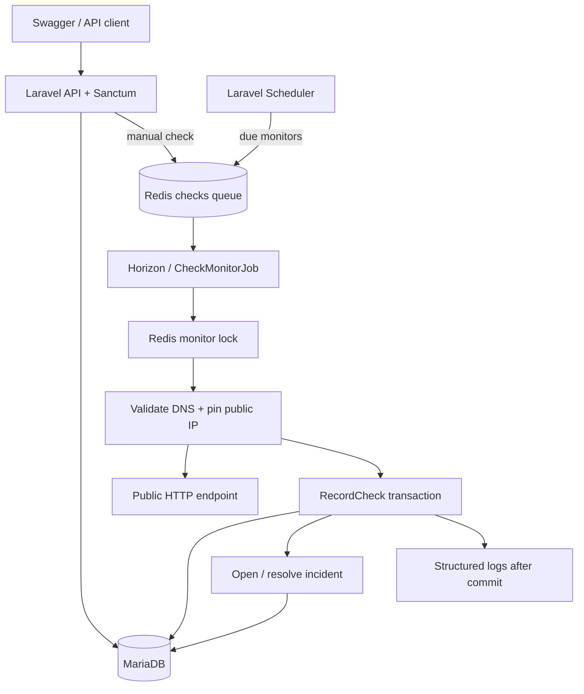

# Sentinel

**HTTP monitoring and automatic incident management, exposed through a Laravel API.**

Register an endpoint, inspect its checks, and follow an incident from repeated failures through recovery. Sentinel V1 concentrates on that complete flow. There is no frontend application; Swagger UI is the interactive interface.

## Start here

Requirements: Docker Engine/Desktop with Linux containers and Docker Compose v2.24+. No host PHP, Composer, Node, or Make is required.

```bash
git clone https://github.com/EduardoCaversan/sentinel.git
cd sentinel
cp .env.example .env
docker compose up --build -d --wait
```

On PowerShell, use `Copy-Item .env.example .env`. Alternatively, `make setup` starts the same stack, using local defaults if `.env` is absent.

Open **[localhost:8080/docs](http://localhost:8080/docs)**. The initial build downloads dependencies and compiles PHP extensions; later builds reuse those layers. Initialization creates a persistent local application key and runs migrations. Application, worker, and scheduler start after initialization succeeds.

If port 8080 is unavailable, set `APP_PORT=18080` and `APP_URL=http://localhost:18080` in `.env`, then run `docker compose up -d --wait` again. The API is bound to the host's loopback interface.

| URL | Purpose |
| --- | --- |
| `/` | Product information and discovery links |
| `/docs` | Swagger UI with Authorize and Try it out |
| `/openapi.json` | OpenAPI 3.0 specification |
| `/health` | Application liveness |
| `/health/ready` | MariaDB and Redis connectivity; 503 on failure |
| `/api/v1` | Versioned API route prefix |

## What V1 does

- Sanctum Bearer tokens: registration, login, current user, logout, seven-day expiry.
- Owner-scoped monitor CRUD, paginated check history and incidents.
- Scheduled GET requests and manual asynchronous checks.
- Consecutive failure/recovery thresholds, automatic opening and resolution.
- Redis queue deduplication and execution locks, transactional result recording, database-enforced uniqueness of open incidents.
- Public-address validation, connection pinning, disabled redirects and sanitized network errors.
- JSON logs with monitor, check, incident and execution IDs.
- Docker setup, demo seeding, automated tests, Pint and GitHub Actions.

## Architecture

PHP 8.4, Laravel 12, MariaDB 11.4 LTS, Redis 7.4, Horizon 5, Sanctum 4, PHPUnit 11 and Swagger UI 5. Composer dependencies are locked. Apache and PHP run in one image, shared by the web service, Horizon, and scheduler. Swagger assets are bundled into the image; browsing documentation does not depend on a CDN.



### Monitoring behavior

`monitors:dispatch` scans due, active monitors every minute and queues jobs in chunks. Checks are never executed inside the scheduler. Intervals range from 60 seconds to 24 hours, in minute increments; execution can be up to one scheduler tick late, plus queue delay. The next due time is calculated after completion.

| Condition | Result |
| --- | --- |
| New monitor | `unknown` |
| Success without an open incident | `healthy`; failure streak resets |
| Failure below threshold | `degraded` |
| Failure threshold reached | `down`; one incident opens |
| Success during an outage | Recovery streak increases; remains `down` |
| Failure during recovery | Recovery streak resets |
| Recovery threshold reached | `healthy`; incident resolves |

An incident's `started_at` is the threshold-crossing check time. `failure_count` includes the opening streak and later failures; `recovery_count` tracks consecutive recovery successes. A timeout counts as a failure. Unexpected status codes, including redirects, count as failures unless they match the configured status.

Actual configuration edits reset streaks, schedule another check, and invalidate older in-flight results. An open incident remains open until the new configuration meets its recovery threshold. Pausing preserves incident and health history. Deleting a monitor permanently deletes its checks and incidents.

### Concurrency guarantees

- Unique queued jobs coalesce manual/scheduled requests for a monitor while their 120-second lease exists.
- A separate 90-second Redis lock prevents simultaneous probes, including duplicate queue deliveries.
- Job timeout is 45 seconds, Horizon worker timeout 60 seconds, queue retry interval 120 seconds. HTTP timeout is capped at 15 seconds.
- Recording locks the monitor row and commits the check, counters and incident together. An execution UUID prevents a delivered job from recording twice.
- A generated nullable `open_slot` plus a unique `(monitor_id, open_slot)` index permits one open incident and any number of resolved incidents. This is tested on both SQLite and MariaDB.
- A configuration version rejects results collected before a concurrent edit. Deleted and paused monitors are safely skipped.

These are bounded leases, not an exactly-once queue guarantee. A long backlog can outlive the unique lease and admit another job; monitor locks still prevent overlapping probes. Monitor queue age and capacity. Worker crashes are retried by future scheduled checks rather than immediate network retries.

Controllers handle HTTP orchestration, Form Requests validate inputs, Resources define output, and custom route binding scopes every monitor to its owner. `HttpProbe` handles network safety; `RecordCheck` owns the state transitions. No repository layer or unused event hierarchy is needed. Meaningful notification events can be introduced with the first notification side effect.

## Explore through Swagger

1. Call `POST /api/v1/auth/register` or log in to an existing account.
2. Copy `data.token`, click **Authorize**, and paste the token without a `Bearer` prefix.
3. Create a monitor for `https://example.com`.
4. Call `POST /api/v1/monitors/{monitor}/check`.
5. Inspect `/checks`, then the monitor's current status.
6. To demonstrate an outage, change `expected_status_code` to `503` and use `failure_threshold: 2`. Two completed checks against a target returning 200 open an incident. Change the expectation back to 200; two successful checks resolve it with the default recovery threshold.

A manual request returns **202 Accepted**. It can reuse an existing queued/running check; poll history for completion. Paused monitors return 409. No synchronous networking occurs in the API request.

### API conventions

Successful objects use `{"data": {...}}`. Lists add Laravel `links` and `meta`, accept `page` and `per_page` (default 20, maximum 100), and sort newest ID first. Errors use `{"message": "..."}`; validation errors add an `errors` field mapping names to message arrays. Deletion and logout return 204 without a body.

Other owners' resources return 404. Authentication failures return 401. Rate limits are 120 requests/minute per user or guest IP, 10 combined registration/login requests/minute per IP, and six manual checks/minute per user. Limits use Redis in the application stack. Swagger documents all fields, enums, status codes and pagination schemas.

```bash
# Register; choose your own password.
curl -X POST http://localhost:8080/api/v1/auth/register \
  -H 'Content-Type: application/json' -H 'Accept: application/json' \
  -d '{"name":"Ada","email":"ada@example.com","password":"ChooseYourOwn123!","password_confirmation":"ChooseYourOwn123!"}'

# Set TOKEN to the returned data.token.
curl -X POST http://localhost:8080/api/v1/monitors \
  -H "Authorization: Bearer $TOKEN" -H 'Content-Type: application/json' \
  -d '{"name":"Payment API","url":"https://example.com","failure_threshold":3,"recovery_threshold":2}'

curl -X POST http://localhost:8080/api/v1/monitors/1/check \
  -H "Authorization: Bearer $TOKEN" -H 'Accept: application/json'
```

## Demo data

Set these values in `.env`, choosing your own password:

```dotenv
DEMO_SEED=true
DEMO_EMAIL=reviewer@example.com
DEMO_PASSWORD=replace-with-a-unique-password
```

Run `docker compose up -d --wait`. The init service seeds Payment API, Authentication API and Checkout API, with synthetic historical checks and a resolved incident. These names illustrate a product environment; their live target is `https://example.com`. Seeding is idempotent and does not reset an existing user's password. To seed an already-running stack after environment changes, recreate it first, then run `docker compose exec app php artisan db:seed`.

Demo credentials are opt-in and never built into the image. For a public shared demo, disable registration with `REGISTRATION_ENABLED=false`, set monitor/account quotas at the gateway or add them before exposure, and reset demo data regularly. A shared account can edit and delete all of its own demo resources.

## Development commands

| Make | Docker Compose equivalent |
| --- | --- |
| `make setup` | `docker compose up --build -d --wait` |
| `make up` | `docker compose up -d --wait` |
| `make down` | `docker compose down` |
| `make test` | `docker compose exec app php artisan test` |
| `make lint` | `docker compose exec app vendor/bin/pint --test` |
| `make logs` | `docker compose logs -f --tail=100` |
| `make shell` | `docker compose exec app sh` |

Code is copied into the image for portable, reproducible runtime behavior. **Rebuild after source changes** with `docker compose up --build -d --wait`. Data, Redis persistence and runtime storage use named volumes and survive `down`. Removing volumes destroys local data.

For native PHP development, use Linux/WSL with PHP 8.4 and Composer 2. Required extensions include cURL, mbstring, PDO MySQL, PDO SQLite (tests), intl, zip, Redis, pcntl and posix (Horizon). Start reachable MariaDB and Redis services, adjust the `.env` hosts, then run:

```bash
composer install
php artisan key:generate
php artisan migrate
php artisan serve
# In separate terminals:
php artisan horizon
php artisan schedule:work
```

Docker builds bundle Swagger UI. For native development, copy `/var/www/html/public/vendor` from a built container to `public/vendor`. No frontend build is needed.

### Environment

| Variable | Purpose |
| --- | --- |
| `APP_ENV`, `APP_DEBUG` | `local` by default; use `production` and false for deployment |
| `APP_KEY` | Required external secret in production; generated into persistent storage for local Docker use |
| `APP_URL`, `APP_PORT` | Public base URL and local mapped port |
| `DB_*`, `DB_ROOT_PASSWORD` | Database connection and local MariaDB bootstrap credentials |
| `REDIS_HOST`, `REDIS_PORT` | Queue, cache and distributed lock service |
| `QUEUE_CONNECTION`, `CACHE_STORE` | Redis in the provided stack |
| `REDIS_QUEUE_RETRY_AFTER` | 120 seconds; keep longer than the worker timeout and execution lock |
| `LOG_CHANNEL`, `LOG_LEVEL` | JSON stderr logging in Compose |
| `REGISTRATION_ENABLED` | Whether new users can register |
| `DEMO_SEED`, `DEMO_EMAIL`, `DEMO_PASSWORD` | Optional demo data |

Compose deliberately supplies internal service hostnames, database name/user, queue/cache drivers and `APP_DEBUG=false`; use an explicit production Compose override for externally managed services. Host and container environment details are listed in `.env.example` and `compose.yaml`.

## Tests and checks

```bash
docker compose exec app composer install --no-interaction
docker compose exec app composer validate --strict
docker compose exec app php artisan migrate --force
docker compose exec app php artisan test
docker compose exec app vendor/bin/pint --test
docker compose exec app php artisan horizon:status
docker compose exec app php artisan schedule:list
docker compose exec app php scripts/verify-locks.php
```

Default tests use isolated in-memory SQLite, fake public DNS and fake HTTP responses. They cover auth, token revocation, rate limits, every ownership boundary, CRUD, pagination, validation, network outcomes, thresholds, resets, idempotency, lock contention, stale results, duplicate-incident constraints and SSRF. They do not call the public internet.

Run the same suite against a **separate MariaDB test database**:

```bash
docker compose cp scripts/create-test-database.sh mariadb:/tmp/create-test-database.sh
docker compose exec mariadb sh /tmp/create-test-database.sh
docker compose exec app vendor/bin/phpunit --configuration=phpunit.mariadb.xml
```

`phpunit.mariadb.xml` always uses `sentinel_testing`; tests recreate its tables. Never point it at valuable data. GitHub Actions builds the stack, validates OpenAPI, runs Pint and both database test suites, and checks readiness, Horizon and the scheduler. The workflow itself must run on GitHub after pushing.

An optional end-to-end check uses the actual web server, Redis queue, Horizon, MariaDB and `https://example.com`:

```bash
docker compose exec app php scripts/smoke.php
```

Registration must be enabled. The script creates a random account, demonstrates opening/resolving an incident with real HTTPS probes, deletes its monitor, and revokes its token. The account remains for audit. This internet-dependent check is kept out of CI to avoid external-service flakiness.

## Security and operational limits

### SSRF defenses

URLs are validated when created/changed and again immediately before execution. Only HTTP on port 80 and HTTPS on port 443 are supported. Userinfo, fragments, control characters, backslashes, single-label names and alternate numeric IP formats are rejected. All A/AAAA answers must be public. Private, loopback, link-local, shared-address, multicast, documentation and reserved ranges are blocked; IPv6 is restricted to global unicast, excluding special/tunneling ranges.

The worker pins the selected validated address using `CURLOPT_RESOLVE`, preserves the hostname for TLS validation, forces the cURL transport, bypasses environment proxies and disables redirects and connection reuse. This prevents a second DNS lookup from substituting a private address. TLS verification remains enabled. Response bodies go to a null sink and are never persisted. Error messages are fixed strings; raw network exceptions, target URLs and query strings are not logged by the monitoring flow. Apache access logs omit URLs and headers.

Application validation is **not a substitute for network egress controls**. Production workers should run in an isolated network with firewall rules blocking internal, management and metadata networks for both IPv4 and IPv6. DNS traffic itself is a separate trust boundary. Network routing, publicly addressed internal services, compromised DNS infrastructure and future special-address allocations require operational controls and maintenance.

V1 downloads/discards bodies until the request timeout; it has no response bandwidth quota. Avoid secrets in monitor URLs: authenticated owners can retrieve them from the database/API. There are no user-supplied headers, payloads or request scripts.

### Deploying

- Build `docker build --target production -t sentinel:production .` to omit development dependencies from the final filesystem.
- Supply a stable, external `APP_KEY`, unique DB credentials, `APP_ENV=production`, `APP_DEBUG=false`, and an HTTPS `APP_URL`. Local fallback DB passwords are only for development.
- Run migrations once per deployment before workers and web traffic. Restart Horizon/scheduler on deploy so they pick up code changes. Cache configuration/routes only after runtime secrets are present.
- Keep one scheduler and one small Horizon supervisor initially. The default worker count scales from one to two processes. Use the same MariaDB and Redis for all replicas.
- Place TLS termination and request/body limits at a reverse proxy. Configure Laravel trusted proxies narrowly before relying on forwarded scheme/client IP; do not trust arbitrary forwarded headers.
- MariaDB and Redis have no host-published ports. Put them on private networks, use access controls, backups and retention policies. Redis uses AOF and `noeviction` because evicting locks/queue keys would undermine correctness.
- Horizon's HTTP dashboard is denied by default, including locally. Use `horizon:status`, `horizon:supervisors`, queue logs and infrastructure metrics. Add explicit operator authentication before exposing the dashboard.
- Readiness checks database/Redis connectivity, not scheduler freshness or queue age. Alert separately on failed jobs, worker health, dispatch freshness, disk usage and queue backlog.
- History has no automatic retention or resource quotas in V1. Define retention, monitor/account limits and abuse controls before public registration. Native DNS lookup time is governed by the resolver; the worker timeout bounds a stuck job, but such a killed job may not produce a check row.

## Roadmap

Intentionally deferred: organizations/teams, RBAC, notification events and email/Slack/Discord/Teams/webhooks, SSL and TCP monitoring, SLO/SLA and uptime/latency analytics, public status pages, maintenance windows, acknowledgements, postmortems, API key management, escalation policies and multiple monitoring regions. Retention, quotas and operational metrics should precede a public multi-user deployment. Static analysis can be added after the current slice; V1 uses Pint and behavioral tests.

## License

MIT. See [LICENSE](LICENSE). Bundled Swagger UI retains its upstream license at `public/vendor/SWAGGER-LICENSE` inside the built image.
